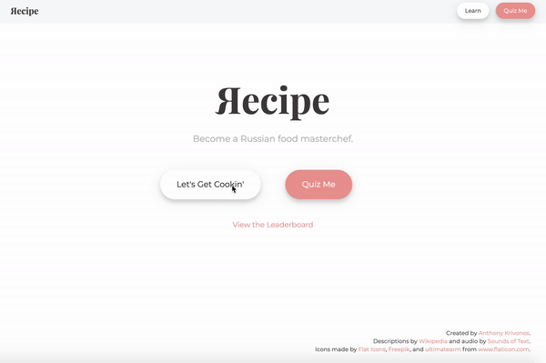

# Яecipe

Interactive UI for learning to cook Russian food.

Final project of Prof. Chilton's UI Design class at Columbia (Spring 2020).

Find a live version on
[anthonykrivonos.pythonanywhere.com](http://anthonykrivonos.pythonanywhere.com).

## Running 

`python server.py`
